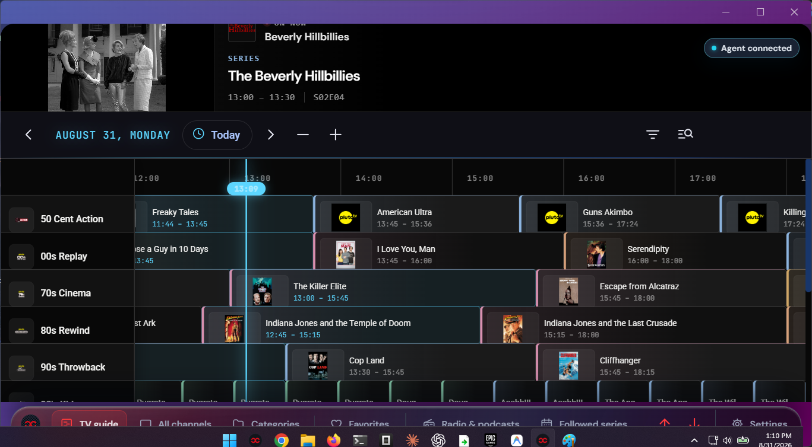
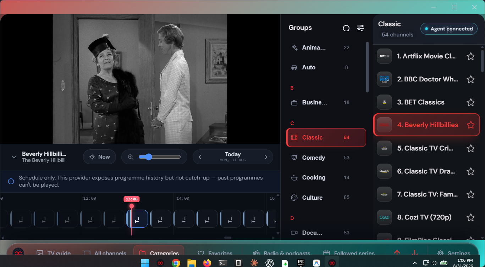
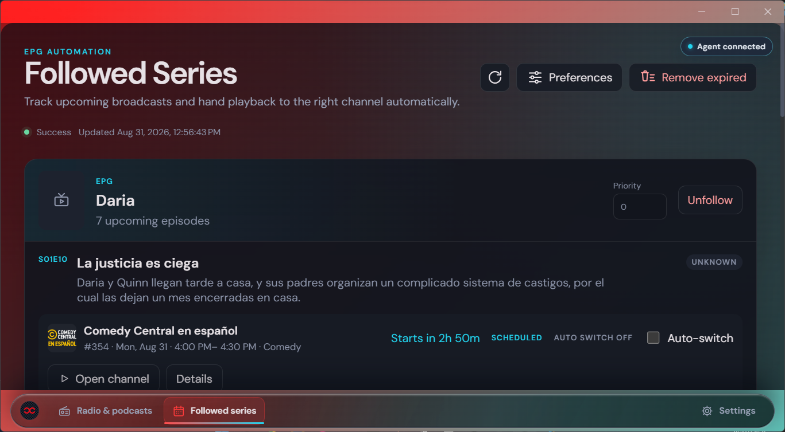
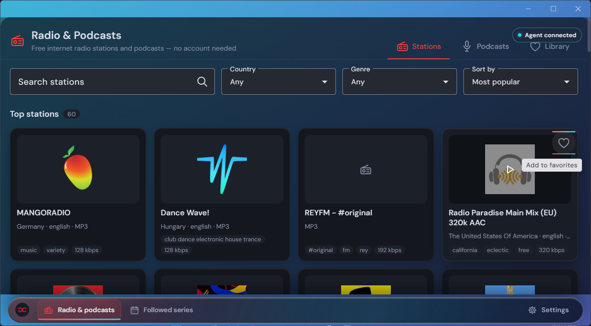
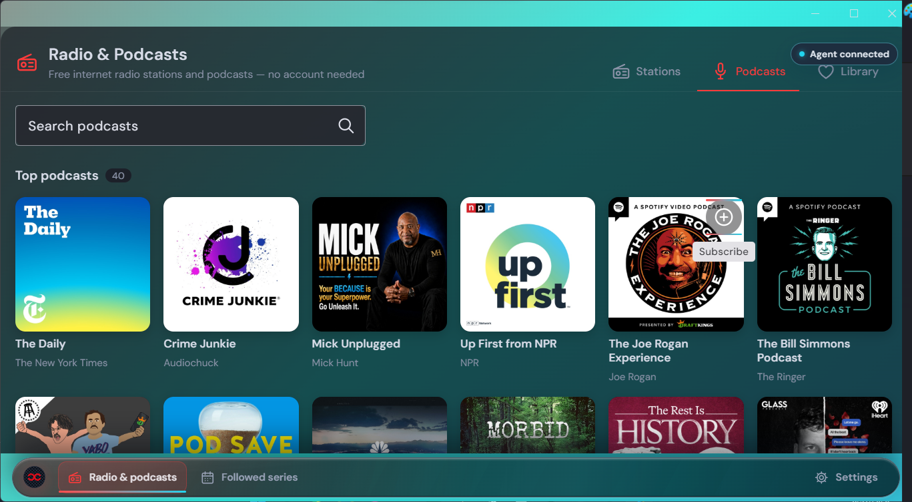

<p align="center">
  <picture>
    <source media="(prefers-color-scheme: dark)" srcset="./carboncast-implementation/assets/logos/png/logo-horizontal-dark.png">
    <source media="(prefers-color-scheme: light)" srcset="./carboncast-implementation/assets/logos/png/logo-horizontal-light.png">
    
  </picture>
</p>

<p align="center">
  <strong>A modern, high-performance, open-source IPTV player for Desktop, Web, and Self-Hosted environments.</strong>
</p>

<p align="center">
  <a href="https://github.com/Snapwave333/carbon_cast/releases/latest">
    
  </a>
  <a href="https://snapwave333.github.io/carbon_cast/">
    
  </a>
  <a href="https://github.com/Snapwave333/carbon_cast/blob/main/LICENSE.md">
    
  </a>
  
  
  
</p>

---

## Table of Contents

- [In-App Screenshots](#in-app-screenshots)
- [Key Features](#key-features)
  - [Playlists and Sources](#playlists-and-sources)
  - [Playback Engines](#playback-engines)
  - [Live TV and EPG](#live-tv-and-epg)
  - [Movies and Series (VOD)](#movies-and-series-vod)
  - [Discovery and Organization](#discovery-and-organization)
  - [AI Agent Control](#ai-agent-control-and-automation)
  - [Platform Support Matrix](#platform-support-matrix)
- [AI Agents and CLI Pipeline (MCP)](#ai-agents-and-cli-pipeline-mcp)
  - [Dual-Surface Architecture](#dual-surface-architecture)
  - [One-Command Global Installation](#one-command-global-installation)
  - [Agent Tool Capabilities](#agent-tool-capabilities)
  - [Command Line Usage (`iptvctl`)](#command-line-usage-iptvctl)
- [Architecture Overview](#architecture-overview)
- [Quick Start](#quick-start)
  - [Desktop Application](#desktop-application)
  - [Self-Hosted PWA (Docker)](#self-hosted-pwa-docker)
  - [Local Development and Diagnostics](#local-development-and-diagnostics)
- [Keyboard Shortcuts](#keyboard-shortcuts)
- [Troubleshooting](#troubleshooting)
- [Repository Navigation](#repository-navigation)
- [Attribution](#attribution)
- [License and Trademark](#license-and-trademark)

---

## In-App Screenshots

<table>
  <tr>
    <td align="center">
      
      <br /><sub><b>Live TV Guide &amp; EPG Timeline</b></sub>
    </td>
    <td align="center">
      
      <br /><sub><b>Category &amp; Channel Browser</b></sub>
    </td>
  </tr>
  <tr>
    <td align="center">
      
      <br /><sub><b>Followed Series &amp; Season Tracker</b></sub>
    </td>
    <td align="center">
      
      <br /><sub><b>Live Radio &amp; Station Streaming</b></sub>
    </td>
  </tr>
  <tr>
    <td align="center" colspan="2">
      
      <br /><sub><b>Podcasts &amp; On-Demand Audio Hub</b></sub>
    </td>
  </tr>
</table>

---

## Key Features

### Playlists and Sources
- **M3U / M3U8** — Import from local files or remote HTTP/HTTPS URLs with auto-refresh on application startup.
- **Xtream Codes (XC)** — Full API integration for live streams, movies, and TV series with server-side sorting and pagination.
- **Stalker / Ministra (STB)** — Emulated STB authentication and multi-category portal streaming.
- **Network Customization** — Configurable custom `User-Agent` headers and per-source HTTP proxy settings.

### Playback Engines
- **Built-in Web Players** — HTML5 (HLS.js), Video.js, and ArtPlayer with resizable inline view and full-screen transport controls.
- **Unified CarbonCast Controls** — Shared glassmorphic HUD for HTML5, Video.js, and ArtPlayer.
- **Embedded MPV** — Direct native MPV rendering within the application window on macOS, Windows, and Linux.
- **External Player Integration** — Launch streams directly in MPV, VLC, or IINA with customizable command-line arguments.
- **DASH & DRM Support** — Playback for MPEG-DASH (`.mpd`) manifests with ClearKey support via Shaka Player.
- **Dedicated Audio & Radio Player** — Dedicated audio view for radio channels and podcasts with keyboard controls.

### Live TV and EPG
- **XMLTV Electronic Program Guide** — Live timeline ribbon, program dialogs, and multi-channel grid.
- **Archive and Timeshift** — Support for catch-up and timeshift playback on supported providers.
- **Channel Navigation** — Channel-number dialing, group filtering, favorite toggles, and instant search.

### Movies and Series (VOD)
- **Two-State Detail Pages** — Seamless transition between metadata browsing and inline playback.
- **TMDB Enrichment** — Optional TMDB integration for posters, cast details, plot overviews, and similar title recommendations.
- **Offline Download Manager** — Multi-threaded background downloader for VOD streams and episodes (desktop).
- **Episode Tracking** — Season selector, episode progress tracking, and continue-watching state.

### Discovery and Organization
- **Global Search** — Unified search across live TV, movies, and TV series with local caching.
- **Unified Favorites & History** — Cross-playlist favorites aggregation and watch history tracking.
- **Command Palette** — Keyboard-driven command navigation (`Ctrl+K` / `Cmd+K`).

### AI Agent Control and Automation
- **Model Context Protocol (MCP)** — Stdio JSON-RPC MCP server (`carboncast-mcp`) for LLM agents (Claude, Gemini, Cursor, Codex).
- **CLI Pipeline (`iptvctl`)** — Command-line interface for playback, channel navigation, EPG queries, and window management.
- **Dual-Surface Architecture** — Fast offline catalog reads via `node:sqlite` combined with authenticated live loopback control.

### Platform Support Matrix

| Feature Area | Desktop (Electron) | Web / PWA |
| :--- | :---: | :---: |
| M3U, Xtream Codes, and Stalker Portals | Yes | Yes |
| Electronic Program Guide (XMLTV) | Yes | No |
| Embedded MPV Player | Yes | No |
| Download Manager | Yes | No |
| MCP Server & Agent Control | Yes | No |
| Automatic Updates | Yes | No |
| Docker Self-Hosting | No | Yes |
| Mobile Remote Control | Yes | No |
| Internationalization (19 Locales) | Yes | Yes |

---

## AI Agents and CLI Pipeline (MCP)

CarbonCast IPTV includes a built-in **Model Context Protocol (MCP)** server and command-line tool (`iptvctl`), providing AI agents and terminal workflows with full access to the catalog, program guide, and active playback session.

### Dual-Surface Architecture

```
+--------------------------------------------------------+
|  AI Agents (Claude / Gemini / Cursor) · CLI (iptvctl)   |
+---------------------------+----------------------------+
                            |
            +---------------+---------------+
            |                               |
            v                               v
   [Offline / Fast Path]            [Live Control Path]
   Direct SQLite Reads              Loopback HTTP Bridge
   via `node:sqlite`                `/api/agent-control/v1`
   (App may be closed)              (Bearer Token + Scopes)
            |                               |
            v                               v
   Local Metadata DB               Running Electron App
   (Playlists, Channels, EPG)      (Player, State, Window Lifecycle)
```

### One-Command Global Installation

To register the `carboncast` MCP server across all installed AI coding agents (Claude Code, Claude Desktop, Gemini CLI, Codex CLI) and add `iptvctl` to your system path:

```bash
node tools/global/install-global.mjs
```

> [!NOTE]
> Pass `--dry-run` to preview all configuration updates without modifying agent configuration files.

### Agent Tool Capabilities

| Domain | Operations |
| :--- | :--- |
| **Library** | `list_playlists`, `list_categories`, `list_channels`, `search_channels`, `get_channel`, `list_favorites`, `list_downloads` |
| **Live EPG** | `whats_on_now`, `get_epg_now_next`, `find_now_playing`, `get_epg_schedule`, `epg_refresh` |
| **Playback** | `player_get_state`, `player_play`, `player_pause`, `player_stop`, `player_set_volume`, `player_seek`, `player_toggle_picture_in_picture` |
| **Channels** | `channel_list_active`, `channel_switch`, `channel_next`, `channel_previous` |
| **State** | `favorites_set`, `follows_list`, `follows_set`, `follows_set_auto_switch` |
| **Desktop & Window** | `app_launch`, `app_quit`, `app_display_list`, `app_display_move`, `app_window_set` |
| **Security** | `agent_tokens_list`, `agent_tokens_create`, `agent_tokens_revoke`, `agent_tokens_rotate` |

### Command Line Usage (`iptvctl`)

```bash
# Query currently playing programme
iptvctl epg now

# Search for a channel and switch to it
iptvctl channel switch "BBC One"

# Control playback
iptvctl player pause
iptvctl player volume 85

# Manage multi-monitor window placement
iptvctl app display list
iptvctl app display move --next
```

---

## Architecture Overview

```
CarbonCast IPTV (Nx Monorepo)
├── apps/
│   ├── electron-backend/   ── Electron main process: IPC bridge, SQLite, native MPV, updater
│   ├── web/                ── Angular renderer: User interface, NgRx store, player components
│   ├── website/            ── Astro documentation and marketing website
│   └── mcp-server/         ── Model Context Protocol stdio server for AI agents
└── libs/
    ├── m3u-state/          ── NgRx playlist state management (actions, effects, reducers)
    ├── playlist/           ── M3U parsing, normalization, Xtream/Stalker clients, import dialogs
    ├── portal/             ── Portal modules for Xtream Codes, Stalker, and Radio
    ├── ui/
    │   ├── components/     ── Shared UI components: channel lists, heroes, season cards
    │   ├── epg/            ── EPG timeline ribbon and multi-channel grid
    │   ├── playback/       ── Video and audio players (HTML5, Video.js, ArtPlayer, MPV)
    │   └── styles/         ── Design tokens, spatial system, and glassmorphic theme
    ├── services/           ── Settings store, history, favorites, and remote control
    ├── shared/interfaces/  ── TypeScript domain interfaces and contracts
    └── workspace/
        ├── shell/          ── Application shell: navigation rail, global search, playback dock
        └── dashboard/      ── Dashboard rails: recently watched, continue watching
```

---

## Quick Start

### Desktop Application
Download the latest installer or package for your operating system from the **[Releases page](https://github.com/Snapwave333/carbon_cast/releases/latest)**.

| Operating System | Package Formats |
| :--- | :--- |
| Windows | `.exe` NSIS installer, portable `.zip` |
| macOS | `.dmg` (Universal binary for Intel and Apple Silicon) |
| Linux | `.AppImage`, `.deb`, `.rpm`, `.snap`, Flatpak |

### Self-Hosted PWA (Docker)
```bash
docker compose -f docker/docker-compose.yml up --build -d
# Access web player at: http://localhost:4333
```

### Local Development and Diagnostics
```bash
corepack enable
pnpm install
pnpm run serve:backend      # Runs Electron main and Angular renderer
pnpm run serve:frontend     # Runs Angular frontend only (http://localhost:4200)
```

Diagnostic flags for Electron development:
```bash
IPTVNATOR_TRACE_STARTUP=1 pnpm run serve:backend   # Full startup tracing
IPTVNATOR_TRACE_IPC=1     pnpm run serve:backend   # Trace IPC bridge requests
IPTVNATOR_TRACE_SQL=1     pnpm run serve:backend   # Trace SQLite statements
```

---

## Keyboard Shortcuts

> Press `?` or `Shift+/` in the application to display the interactive shortcuts guide.

| Category | Shortcut | Action |
| :--- | :---: | :--- |
| Global | `Ctrl/Cmd+K` | Open command palette |
| Global | `Ctrl/Cmd+F` | Open global search |
| Global | `Ctrl/Cmd+R` | Open recently viewed content |
| Navigation | `Ctrl/Cmd+B` | Toggle channel sidebar |
| Navigation | `0–9` | Dial channel by number |
| Playback | `Space` / `K` | Play / Pause playback |
| Playback | `F` | Toggle full-screen mode |
| Playback | `Left` / `Right` | Seek backward / forward 5 seconds |
| Playback | `Up` / `Down` | Increase / decrease volume by 5% |
| Playback | `M` | Mute or unmute audio |
| Dialogs | `Up` / `Down` | Navigate list items |
| Dialogs | `Enter` | Select or confirm item |
| Dialogs | `Escape` | Dismiss overlay or close dialog |

---

## Troubleshooting

<details>
<summary><b>macOS: "App is damaged and can't be opened"</b></summary>

Remove the Gatekeeper quarantine attribute:
```bash
xattr -c "/Applications/CarbonCast IPTV.app"
```
</details>

<details>
<summary><b>Linux: chrome-sandbox permissions error</b></summary>

```bash
sudo chown root:root chrome-sandbox && sudo chmod 4755 chrome-sandbox
# Or launch without the sandbox:
iptvnator --no-sandbox
```
</details>

<details>
<summary><b>Linux: Wayland display initialization</b></summary>

```bash
iptvnator --ozone-platform=x11
```
The Snap distribution applies this override automatically.
</details>

<details>
<summary><b>Linux: Embedded MPV requirements</b></summary>

Embedded MPV on Linux requires:
- x86_64 architecture
- X11 or XWayland environment (native Wayland embedding is not currently supported)
- System `mpv` binary installed and accessible on `PATH`
</details>

---

## Repository Navigation

| Documentation | Description |
| :--- | :--- |
| [Official Website](https://snapwave333.github.io/carbon_cast/) | Downloads, application tours, and release announcements |
| [Table of Contents](./TABLE_OF_CONTENTS.md) | Canonical index of apps, libraries, architecture documents, and scripts |
| [Architecture & Development](./CLAUDE.md) | In-depth technical architecture, module contracts, and commands |
| [Agent Operating Rules](./AGENTS.md) | Development rules, testing standards, and release note policy |
| [Release Notes](./.changes/) | Structured user-facing release notes by subsystem |

---

## Attribution

CarbonCast IPTV is an independent, enhanced fork of [IPTVnator](https://github.com/4gray/iptvnator) created by [@4gray](https://github.com/4gray). The upstream project and its contributors are recognized under the original open-source license. CarbonCast IPTV is not affiliated with or endorsed by upstream maintainers.

> [!NOTE]
> CarbonCast IPTV does not distribute, host, or bundle any playlists, channels, or multimedia content. All channel representations and screenshots are shown for illustrative purposes only.

---

## License and Trademark

This project is licensed under the terms described in [LICENSE.md](./LICENSE.md). CarbonCast IPTV is an independent fork; upstream trademarks and logos remain the property of their respective owners. Refer to [TRADEMARK.md](./TRADEMARK.md) for further details.
