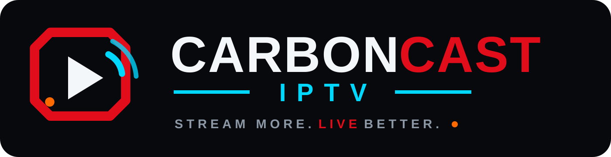

<p align="center">
  <picture>
    <source media="(prefers-color-scheme: dark)" srcset="./carboncast-implementation/assets/logos/logo-horizontal-dark.svg">
    <source media="(prefers-color-scheme: light)" srcset="./carboncast-implementation/assets/logos/logo-horizontal-light.svg">
    
  </picture>
</p>

<p align="center">
  <strong>A modern, high-performance, open-source IPTV player — Desktop, Web &amp; Self-Hosted</strong>
</p>

<p align="center">
  <a href="https://github.com/Snapwave333/carbon_cast/releases/latest">
    
  </a>
  <a href="https://snapwave333.github.io/carbon_cast/">
    
  </a>
  <a href="https://github.com/Snapwave333/carbon_cast/blob/main/LICENSE.md">
    
  </a>
  
  
  
</p>

---

## 📸 In-App Screenshots

<table>
  <tr>
    <td align="center">
      
      <br /><sub><b>Live TV · Inline Player · EPG</b></sub>
    </td>
    <td align="center">
      
      <br /><sub><b>Dashboard · Continue Watching</b></sub>
    </td>
  </tr>
  <tr>
    <td align="center">
      
      <br /><sub><b>Multi-Channel EPG Guide</b></sub>
    </td>
    <td align="center">
      
      <br /><sub><b>VOD · Movie Detail &amp; Playback</b></sub>
    </td>
  </tr>
  <tr>
    <td align="center">
      
      <br /><sub><b>Xtream · Recently Added</b></sub>
    </td>
    <td align="center">
      
      <br /><sub><b>Xtream · Category Grid</b></sub>
    </td>
  </tr>
  <tr>
    <td align="center">
      
      <br /><sub><b>Global Search · Live + VOD + Series</b></sub>
    </td>
    <td align="center">
      
      <br /><sub><b>Live Channels · Category Rail</b></sub>
    </td>
  </tr>
  <tr>
    <td align="center">
      
      <br /><sub><b>Radio · Cinematic Audio Player</b></sub>
    </td>
    <td align="center">
      
      <br /><sub><b>Download Manager · Offline Viewing</b></sub>
    </td>
  </tr>
  <tr>
    <td align="center">
      
      <br /><sub><b>Add Playlist · M3U · Xtream · Stalker</b></sub>
    </td>
    <td align="center">
      
      <br /><sub><b>Settings · Playback &amp; Theme</b></sub>
    </td>
  </tr>
</table>

---

## ✨ Features

### 📋 Playlists & Sources
- **M3U / M3U8** — local files or remote URLs, auto-refreshed on startup
- **Xtream Codes (XC)** — live, VOD, and series portals with full API support
- **Stalker / Ministra (STB)** — emulated STB session authentication
- Custom `User-Agent` header and per-source HTTP proxy support

### 📺 Playback
- **Built-in players** — HTML5 (HLS.js), Video.js, and ArtPlayer with resizable inline view
- **Unified CarbonCast Controls** — glass-morphic HUD for HTML5, Video.js, and ArtPlayer _(experimental)_
- **Embedded MPV** — native mpv rendered inside the app on macOS, Windows & Linux _(experimental)_
- **External players** — MPV, VLC, and IINA with per-source arguments
- **DASH + ClearKey** — encrypted `.mpd` streams via Shaka Player
- **Dedicated radio player** 📻 — cinematic hero backdrop with keyboard controls

### 📡 Live TV & EPG
- **XMLTV EPG** — live timeline ribbon, catch-up/timeshift, and multi-channel grid
- Group-based channel list, channel-number selection, and fuzzy search 🔍
- TV archive / catch-up / timeshift _(desktop)_

### 🎬 Movies & Series (VOD)
- **Two-state detail pages** — browse ↔ watch with season tabs and resume positions
- TMDB enrichment — plots, cast & crew, trailers, ratings, artwork, and a "Similar" rail _(opt-in)_
- Download manager for offline movies & episodes ⬇️ _(desktop)_
- "Recently added" feeds, category grids, and sorting & pagination

### 🔍 Discovery & Organization
- Global search across live TV, movies, and series (72-hour local cache) _(desktop)_
- Per-playlist and global favorites aggregated across all playlists ⭐
- Watch history, command palette (`Ctrl/Cmd+K`), and continue-watching rail

### 🌐 Platform
| | Desktop (Electron) | PWA / Web |
| :--- | :---: | :---: |
| M3U / Xtream / Stalker | ✅ | ✅ |
| EPG / XMLTV | ✅ | ❌ |
| Embedded MPV | ✅ | ❌ |
| Download Manager | ✅ | ❌ |
| Auto-Updater | ✅ | — |
| Self-Hosted Docker | — | ✅ |
| Mobile Remote Control | ✅ | ❌ |
| 19 Languages | ✅ | ✅ |

---

## 🏗️ Architecture Overview

```
CarbonCast IPTV (Nx Monorepo)
├── apps/
│   ├── electron-backend/   ← Main process: IPC, SQLite, MPV bridge, auto-updater
│   ├── web/                ← Angular renderer: UI, NgRx store, player components
│   ├── website/            ← Astro marketing site (GitHub Pages)
│   └── mcp-server/         ← Local MCP server for agent automation (stdio)
└── libs/
    ├── m3u-state/           ← NgRx playlist state (actions, effects, reducers)
    ├── playlist/            ← M3U parse/normalize, Xtream, Stalker, import UI
    ├── portal/              ← Portal feature modules (Xtream, Stalker, Radio)
    ├── ui/
    │   ├── components/      ← Shared UI: channel list, heroes, season cards
    │   ├── epg/             ← EPG timeline ribbon + multi-channel grid
    │   ├── playback/        ← HTML5, Video.js, ArtPlayer, Embedded MPV, Audio
    │   └── styles/          ← Global SCSS design tokens & glassmorphism theme
    ├── services/            ← Settings, history, favorites, remote control
    ├── shared/interfaces/   ← Canonical TypeScript interfaces
    └── workspace/
        ├── shell/           ← App shell: navigation rail, search, playback bar
        └── dashboard/       ← Dashboard rails: recently watched, trending
```

---

## ⚡ Quick Start

### Desktop App
Download the latest build for your platform from the **[Releases page](https://github.com/Snapwave333/carbon_cast/releases/latest)**.

| Platform | Format |
| :--- | :--- |
| 🪟 Windows | `.exe` NSIS installer / portable `.zip` |
| 🍎 macOS | `.dmg` universal |
| 🐧 Linux | `.AppImage` · `.deb` · `.rpm` · `.snap` · Flatpak |

### Self-Hosted PWA (Docker)
```bash
docker compose -f docker/docker-compose.yml up --build -d
# → http://localhost:4333
```

### Development
```bash
corepack enable
pnpm install
pnpm run serve:backend      # Electron dev server (+ Electron window)
pnpm run serve:frontend     # Angular PWA only at http://localhost:4200
```

Debug flags:
```bash
IPTVNATOR_TRACE_STARTUP=1 pnpm run serve:backend   # Full startup trace
IPTVNATOR_TRACE_IPC=1     pnpm run serve:backend   # IPC bridge calls
IPTVNATOR_TRACE_SQL=1     pnpm run serve:backend   # SQLite statements
```

---

## ⌨️ Keyboard Shortcuts

> Press `?` or `Shift+/` inside the app to open the interactive shortcuts sheet.

| Area | Shortcut | Action |
| :--- | :---: | :--- |
| Global | `Ctrl/Cmd+K` | Open command palette |
| Global | `Ctrl/Cmd+F` | Open global search |
| Global | `Ctrl/Cmd+R` | Open recently viewed |
| Navigation | `Ctrl/Cmd+B` | Toggle live sidebar |
| Navigation | `0–9` | Select channel by number |
| Playback | `Space` / `K` | Play / Pause (embedded MPV) |
| Playback | `F` | Toggle fullscreen (embedded MPV) |
| Playback | `←` / `→` | Seek ±5 s (embedded MPV) |
| Playback | `↑` / `↓` | Volume ±5% |
| Playback | `M` | Mute / unmute |
| Dialogs | `↑` / `↓` | Move selection |
| Dialogs | `Enter` | Confirm / open |
| Dialogs | `Escape` | Dismiss |

---

## 🔧 Troubleshooting

<details>
<summary><b>🍎 macOS: "App is damaged and can't be opened"</b></summary>

Remove the quarantine flag:
```bash
xattr -c "/Applications/CarbonCast IPTV.app"
```
</details>

<details>
<summary><b>🐧 Linux: chrome-sandbox permissions error</b></summary>

```bash
sudo chown root:root chrome-sandbox && sudo chmod 4755 chrome-sandbox
# or launch with:
iptvnator --no-sandbox
```
</details>

<details>
<summary><b>🐧 Linux: Wayland startup failure</b></summary>

```bash
iptvnator --ozone-platform=x11
```
The Snap package already includes this override by default.
</details>

<details>
<summary><b>🐧 Linux: Embedded MPV requirements</b></summary>

Requires **x64**, **X11 or XWayland**, and `mpv` on `PATH`. Native Wayland embedding is not yet supported.
</details>

---

## 🧭 Repository Navigation

| Guide | Purpose |
| :--- | :--- |
| [🌐 **Official Website**](https://snapwave333.github.io/carbon_cast/) | Downloads, feature tours, and release blog |
| [🗂️ **Table of Contents**](./TABLE_OF_CONTENTS.md) | Apps, libs, feature owners, architecture contracts, and tooling |
| [📖 **Architecture & Commands**](./CLAUDE.md) | Detailed architecture, subsystem contracts, and development guide |
| [⚡ **Agent Operating Rules**](./AGENTS.md) | Coding conventions, validation gates, testing, and release notes |
| [📝 **Release Notes**](./.changes/) | User-facing change log entries by feature area |

---

## 🙏 Attribution

CarbonCast IPTV is an independent, enhanced fork of [IPTVnator](https://github.com/4gray/iptvnator) by [@4gray](https://github.com/4gray). The upstream project and its contributors are credited under the original license. CarbonCast IPTV is not endorsed by the upstream maintainers.

> [!NOTE]
> CarbonCast IPTV does not provide or bundle any playlists or digital media streams. Channel logos and screenshots shown are for demonstration purposes only.

---

## ⚖️ License & Trademark

Licensed under the terms in [LICENSE.md](./LICENSE.md). CarbonCast is an independent fork — the upstream IPTVnator name and logo remain the property of the upstream project. See [TRADEMARK.md](./TRADEMARK.md) for inherited trademark terms.

---

<p align="center">
  <sub>Built with ❤️ · Powered by Electron, Angular &amp; Nx · Carbon UI ⚡</sub>
</p>
