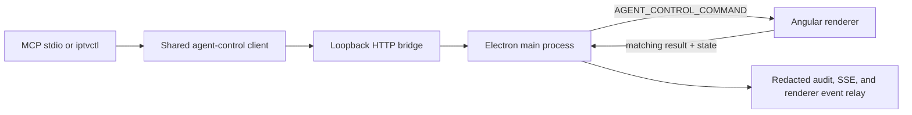

# Agent Control Architecture

IPTVnator exposes one live, renderer-backed control plane for local agents. It
is consumed by the MCP server and `iptvctl`; neither tool fabricates playlist
files, launches a second app instance, or reports a command as applied before
the running renderer acknowledges it.

## Runtime flow



`AgentControlRuntimeService` executes commands through the same NgRx stores,
`SettingsStore`, followed-series service, router, and active built-in media
element used by the GUI. The main process waits up to ten seconds for a
correlation-ID-matched `AGENT_CONTROL_COMMAND_RESULT`; success therefore means
the UI runtime accepted the request, not merely that a request was queued.

## API and result envelope

The bridge is served by the existing remote-control HTTP server when desktop
remote control is enabled. The versioned routes are:

- `GET /health` — unauthenticated liveness only
- `GET /state` — scoped current state
- `GET /events` — Server-Sent Events (`state.changed`, `command.completed`)
- `POST /command` — a safe named operation and parameters
- `GET|POST /tokens`, `POST /tokens/revoke`, `POST /tokens/rotate`

Routing matches on the pathname only, so a query string or a trailing slash
still reaches the right handler. Every agent-control route is additionally
pinned to a loopback `Host` header. The HTTP server itself listens on all
interfaces because phones reach the remote-control web app over the LAN, so
without that pin a page under DNS rebinding could reach the bridge socket from
a browser; a rebound request arrives as `Host: attacker.example` and is
rejected with 403 before authentication runs.
`IPTVNATOR_AGENT_CONTROL_ALLOWED_HOSTS` (comma-separated hostnames) opts
specific hosts back in for deliberate remote automation.

Two abuse limits sit in front of the handlers. Per-token rate limits cannot see
an unauthenticated caller, so rejected credentials are also counted per source
address and locked out for a minute after twenty failures. Request bodies are
capped at 64 KiB and at ten seconds; the shared reader in
`agent-control-http.util.ts` also attaches the `error` listener that keeps an
aborted request from taking the main process down.

`GET /events` writes an SSE comment frame every 25 seconds. Idle-timeout proxies
and sleeping NICs otherwise drop a quiet stream with no signal to either end,
and a failed heartbeat write is how a dead subscriber is detected at all. The
client's connect timeout applies to the handshake only — once the stream is
open it is meant to stay open.

Command responses use a stable envelope: `success`, `operation`, `requested`,
`previousState`, `state`, `timestamp`, `correlationId`, and a structured error
(`code`, `message`, `retryable`) on failure. Requests may safely retry using a
stable correlation ID; the main process retains a bounded completed-result
cache for idempotent retries.

Supported operation families include player transport and volume, channel
selection, EPG refresh/current programme, favorites, followed-series and
auto-switch preferences, safe settings, diagnostics, and internal navigation.
An engine-specific action such as recording, audio-track selection, or PiP
returns `operation-unsupported` when the active engine cannot execute it;
callers must not infer success from an unavailable capability.

## Desktop lifecycle and window control

The `app` command family is first-class agent control, not a player shortcut:

| CLI command                                           | Operation          | Scope            | Behaviour                                                                                                                                                                                                                                                           |
| ----------------------------------------------------- | ------------------ | ---------------- | ------------------------------------------------------------------------------------------------------------------------------------------------------------------------------------------------------------------------------------------------------------------- |
| `app launch`                                          | `app.launch`       | `app.lifecycle`  | When `/health` is unreachable, starts the packaged desktop app and waits up to 60 seconds for `health.ready`. When a bridge answers `ready:false`, it waits instead of opening a second instance.                                                                   |
| `app quit`                                            | `app.quit`         | `app.lifecycle`  | Main-process graceful close after the HTTP response flushes; it calls each window's `close` path, never kills a process.                                                                                                                                            |
| `app display list`                                    | `app.display.list` | `state.read`     | Lists monitor ID, primary/current flags, device-independent bounds, and `scaleFactor`.                                                                                                                                                                              |
| `app display move --next` / `--index N`               | `app.display.move` | `player.control` | Preserves the window's relative position in the target display work area, clamps it on-screen, and restores fullscreen/maximized state. Electron bounds are device-independent pixels, so the returned target `scaleFactor` identifies the active coordinate scale. |
| `app window fullscreen BOOL` / `minimize` / `restore` | `app.window.set`   | `player.control` | Changes the desktop window. This is intentionally separate from `player fullscreen BOOL`, which changes only the media element.                                                                                                                                     |

`app launch`, `app quit`, display move, and window-state changes are writes and
support `--dry-run`; use `--confirm` for the live action. `app launch` is
special because no bridge exists while the app is closed: the CLI launches
locally only after an unreachable health check. The bridge accepts
`app.launch` as an idempotent already-running acknowledgement when it is live,
so agents retain one named lifecycle operation and scope vocabulary.

The main process mirrors its existing `state.changed` and `command.completed`
events to the renderer as redacted IPC. The renderer shows a persistent
**Agent connected** badge once that event path is live, and briefly pulses the
affected player, library, window chrome, or shell surface while an agent
command is executing. The pulse is 180ms and disables animation under
`prefers-reduced-motion`.

```mermaid
sequenceDiagram
    participant CLI as iptvctl
    participant Bridge as control bridge
    participant Main as Electron main
    participant UI as renderer
    CLI->>Bridge: app display/window/lifecycle command
    Bridge->>Main: authorize and dispatch
    Main->>UI: command IPC or window operation
    UI-->>Main: matched command result + state
    Main-->>Bridge: completed result
    Main-->>UI: redacted state.changed / command.completed
    UI-->>UI: badge persists; affected surface pulses for 180 ms
```

`diagnostics.screenshot` is the one exception to the renderer-acknowledgement
rule: it is served entirely from the main process with
`BrowserWindow.capturePage()`. The reason to ask for a screenshot is usually
that the renderer has stopped answering, and a capture gated on the renderer's
acknowledgement would fail in exactly that case. Two constraints follow from it
being reachable over an authenticated HTTP endpoint:

- The file name is generated, never taken from the request. Captures land in
  `<userData>/agent-screenshots/`, timestamped plus a random suffix (two
  captures inside one millisecond would otherwise overwrite each other), and
  the directory is pruned to its newest 40 entries. Accepting a caller-supplied
  path would be an arbitrary file write.
- The absolute path is returned as `file`, not `path`. Every response is passed
  through the credential redactor, whose key pattern includes `path`, so the
  one value the caller needs came back as `[redacted]`.

## Security model

- Every state, event, command, and token-management route requires a bearer
  token with the exact scope required by the operation. `GET /health` leaks no
  account, playlist, or playback details.
- Tokens are persisted only as SHA-256 hashes with label, scopes, creation,
  optional expiry, and revocation timestamp. A valid initial administrator
  token can be supplied through `IPTVNATOR_AGENT_TOKEN` when Electron starts;
  its hash is imported once. `IPTVNATOR_AGENT_TOKEN_EXPIRES_AT` optionally sets
  its expiry.
- Create/rotate return a raw token exactly once to the authenticated caller.
  Raw tokens are never stored, logged, audited, or sent on SSE.
- Reads are limited to 120 requests/minute/token; control and token writes are
  limited to 30 requests/minute/token and return `429` plus `Retry-After`.
- Every command and token lifecycle action is appended as redacted NDJSON in
  Electron `userData/agent-control-audit.ndjson`.
- Recursive redaction masks fields named as credentials, tokens, URLs, stream
  sources, authorizations, or paths. The public state and MCP data adapters
  intentionally expose identifiers and display metadata only—never raw stream
  URLs, portal credentials, playlist source URLs, or file paths.

## MCP and CLI

`apps/mcp-server` retains safe read-only SQLite catalog/EPG queries and forwards
live operations through `apps/agent-control/src/client.mjs`. `apps/iptvctl`
uses that identical client and maps errors to fixed process exit codes:

| Exit | Meaning                                 |
| ---: | --------------------------------------- |
|    0 | command completed                       |
|    2 | usage error                             |
|    3 | authentication or authorization failure |
|    4 | bridge or renderer unavailable          |
|    5 | requested item not found                |
|    6 | conflict                                |
|    7 | rate limited                            |
|    8 | remote command failure                  |
|   10 | internal CLI failure                    |

An HTTP error whose body is not already a failure envelope — a mistyped base
URL, the loopback-host rejection, an unrelated JSON endpoint — is mapped to the
matching failure code rather than passed through. Before that, any JSON object
was returned verbatim and `success !== false` made a 404 exit 0.

CLI diagnostics go to stderr: usage errors, failed operations, and `--verbose`
tracing. `--json` stdout therefore stays parseable even when the command fails,
and a failure is still reported under `--quiet`. An unexpected fault inside
`iptvctl` exits 10 rather than masquerading as a usage error.

`iptvctl health --json` calls the public liveness route and therefore needs no
token. Every other live operation requires `IPTVNATOR_AGENT_TOKEN`. The CLI
rejects unknown flags, malformed typed values, and missing write targets before
it reaches the bridge. Use `--dry-run` to inspect a write, then pass
`--confirm`; when retrying a timed-out write, reuse `--correlation-id ID` so the
bridge can return its cached result rather than repeat the operation.

`iptvctl events` streams the bridge SSE feed as JSON Lines by default (and
`--jsonl` remains explicit). `--dry-run`
shows a write operation without dispatching it, and `--confirm` explicitly
marks an intentional write for operations that require confirmation.

### Global PowerShell command

Hermes exposes the CLI as `carboncast-cli` through the user PATH. Its wrapper
resolves the CarbonCast checkout and sets `CARBONCAST_HOME`, so `app launch`
finds the packaged desktop executable even when invoked from another working
directory. A freshly opened PowerShell can therefore use:

```powershell
carboncast-cli app launch --json
carboncast-cli app display list --json
```
